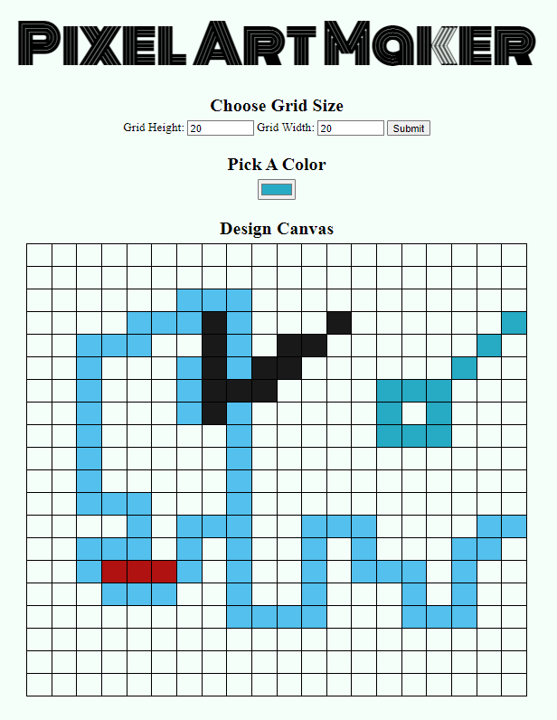

<h2 align="center">
    Pixel Art Maker Project
</h2>
 

  

### Repository Description
This is a single-page web app that allows users to draw pixel art on a customizable canvas!
 
 

### Users should be able to:

- Dynamically set the size of the table as an _N_ by _M_ grid.
- Choose a color.
- Click a cell in the grid to fill that cell with the chosen color.
